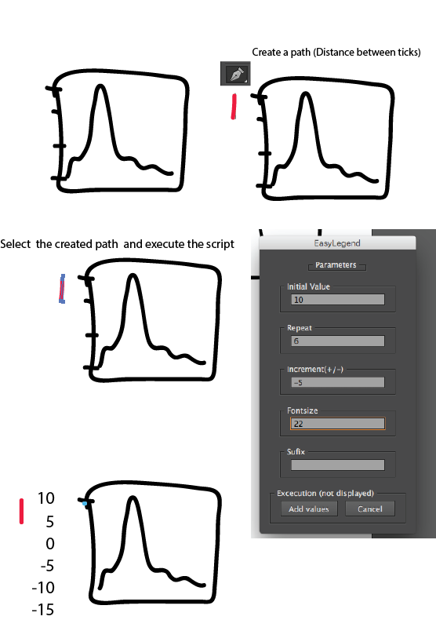

# EasyIllustratorLegends
Javascript code to add ticks to Illustrator figures easly.  
Create a path between two points and execute this script.  
It will generate ticks corresponding to a __initial__ and repeat it a n times (10 default).  
This script can be used with horizontal or vertical paths. 

